# Spendflow Expense Tracker

Spendflow is a React/Vite single-page expense tracking web app for recording expenses, reviewing spending patterns, and managing user accounts. It is built around a user dashboard for personal expense tracking and an admin dashboard for user administration and activity monitoring.

The app behaves like a single-page application. It uses client-side rendering and dynamic interface updates instead of moving users through separate HTML pages for authentication, dashboard tabs, tables, charts, modals, admin management, and account settings.

## Key Features

### Authentication

- Register a new account with a name, username, email, and password.
- Log in with either an email address or username, together with the account password.
- Persist an authenticated session with a JWT.
- Log out through the username dropdown.
- Route users dynamically based on role:
  - regular users enter the expense dashboard;
  - admins enter the user administration dashboard.

### Regular User Flow

- Add expenses with title, amount, category, date, and optional description.
- View personal expenses in the Expense History tab.
- Search expenses by title.
- Filter expenses by category and month.
- Sort expenses by amount, date, or name.
- Edit expenses through row-level and table-level edit flows.
- Save or cancel edits with confirmation protection for unsaved changes.
- Delete expenses through row-level actions.
- Review total spending, category totals, a doughnut chart, and monthly spending trends.
- Open Manage Account from the username dropdown to update account details and password.

### Admin Flow

- Log in through the same authentication screen as regular users.
- Land on the admin user administration dashboard.
- View user administration summary cards for total users, admin users, regular users, and activity events.
- Search, filter, sort, and paginate user accounts.
- Edit permitted user fields from the Admin Users table and user details dialog.
- Delete non-admin user accounts where permitted.
- Review login, logout, registration, account, password, and expense CRUD activity in the Admin Activity tab.
- Open user details to review a selected user's account information and activity history.
- Open Manage Account from the username dropdown to update the admin's own profile details and password.

### Interface and Interaction Design

- Soft dashboard layout with glass-like cards, rounded controls, shadows, and green/mint accents.
- Custom dropdown menus for category, filters, sorting, role filters, action filters, and month selection.
- Custom Add Expense date input and date picker.
- Editable table cells with validation and Save / Cancel flows.
- Toast notifications for success and error feedback.
- Confirmation dialogs for unsaved changes and destructive actions.
- Responsive toolbar wrapping and horizontally scrollable tables for smaller screens.
- Chart.js doughnut and line charts for spending summaries.

## Tech Stack

| Layer | Tools |
| --- | --- |
| Frontend | React, Vite, HTML, CSS, JavaScript |
| Backend | Node.js, Express |
| Database | MySQL |
| Authentication | JWT, bcrypt |
| Charts | Chart.js |
| Database export | `database/expense_tracker.sql` |

## UI Design

Spendflow uses a calm financial dashboard style. The green palette supports the product concept because green is commonly associated with money, growth, balance, and positive financial movement. The visual direction keeps forms, tables, and spending summaries easy to scan.

### Colour Palette

| Use | Colour |
| --- | --- |
| Primary green | `#4DDE83` |
| Mint accent | `#48DDB6` |
| Lime accent | `#A8FF78` |
| Primary gradient | `#58E66F` to `#48DDB6` |
| Hover gradient | `#64ED78` to `#55E8C2` |
| Main text | `#111827` |
| Muted text | `#7B857F` |
| Soft text | `#9CA3AF` |
| Page background | `#FBFFF8`, `#F4FFF0`, `#EFFDF5` |

### Typography

Spendflow uses **Inter** for headings, form fields, table data, chart labels, and navigation text.

## Screenshots

### Login

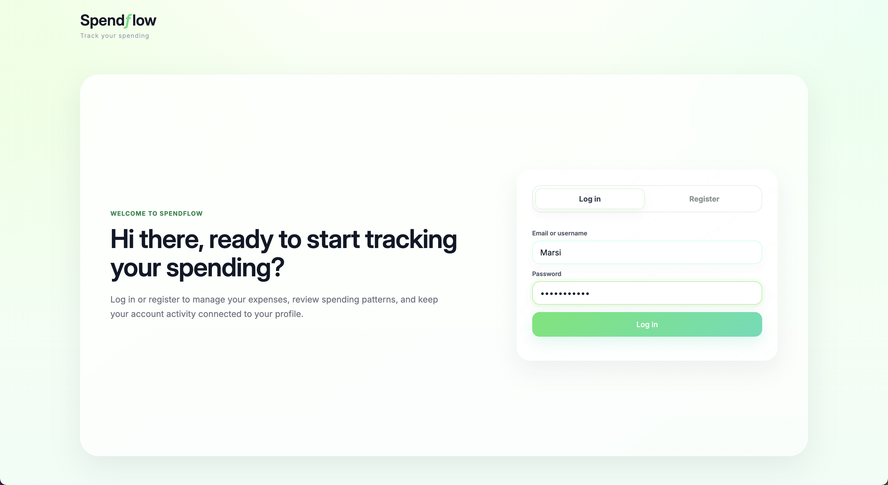

Shared login screen for regular users and admins.

### Register

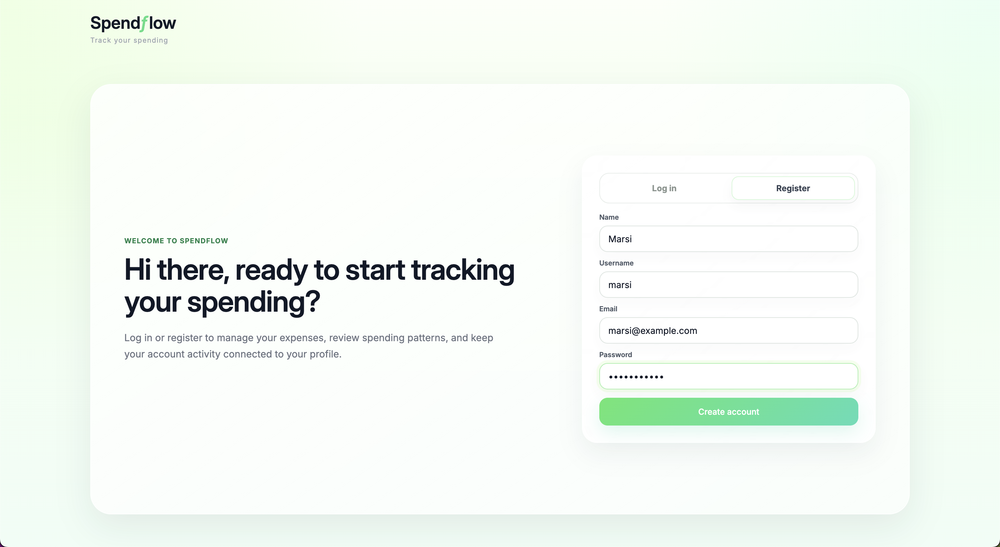

Register screen for creating a new account with name, username, email, and password.

### User Dashboard

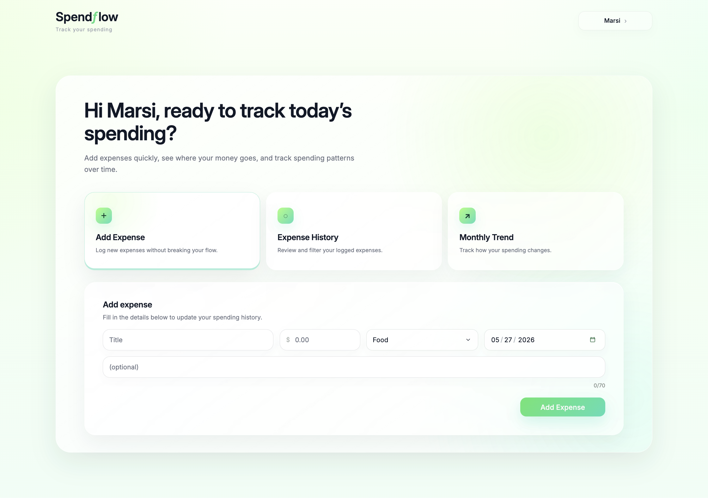

User dashboard with tab-style navigation for Add Expense, Expense History, and Monthly Trend.

### Add Expense

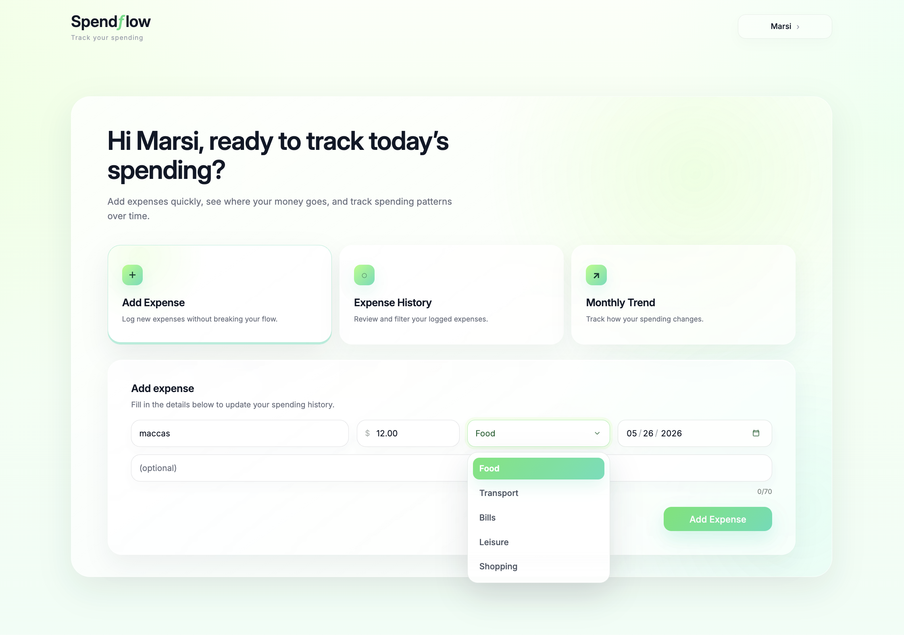

Add Expense tab for logging a new expense with title, amount, category, date, and optional description.

### Expense History

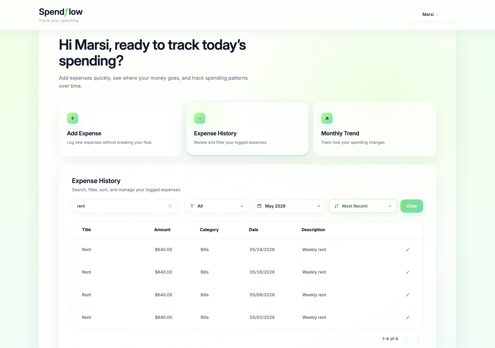

Expense History tab with search, category filtering, month filtering, sorting, pagination, and row actions.

### Expense History Edit Mode

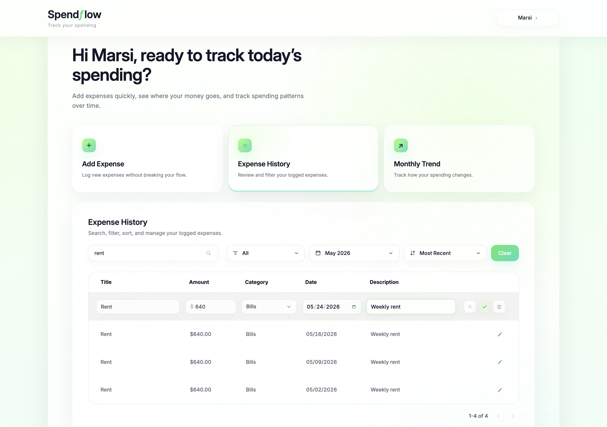

Editable Expense History table with Save / Cancel controls and inline editing.

### Category Breakdown

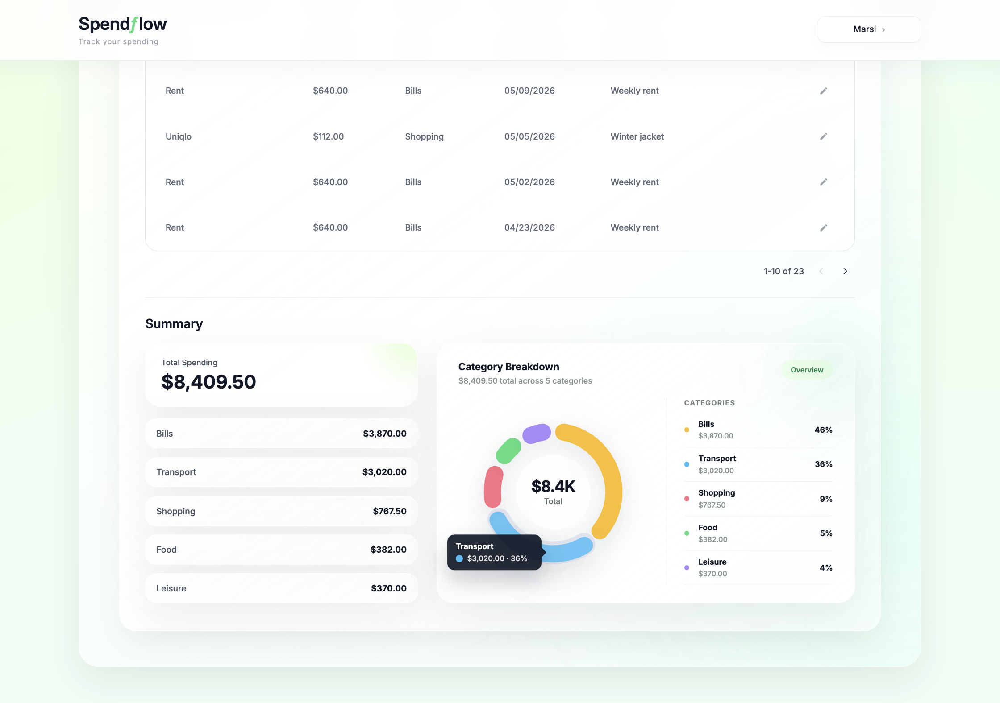

Spending summary with total spending, category totals, and category breakdown chart.

### Monthly Trend

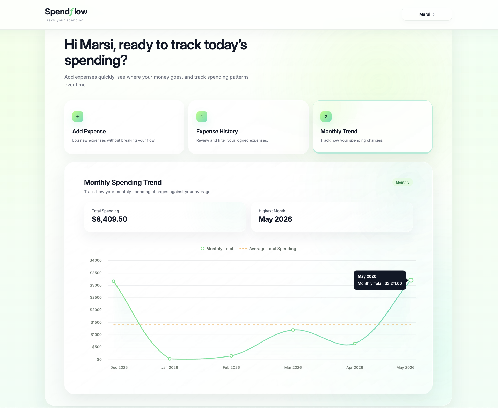

Monthly trend chart showing spending patterns over time.

### Manage Account

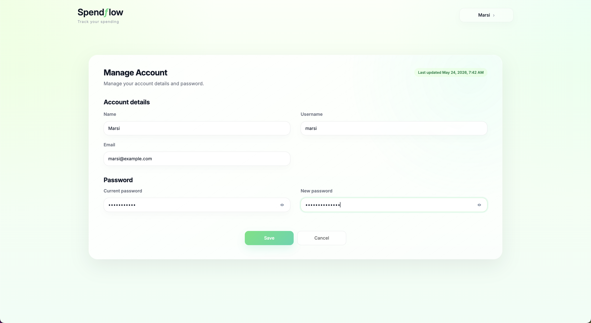

Manage Account view for updating profile details and password.

### Admin Dashboard

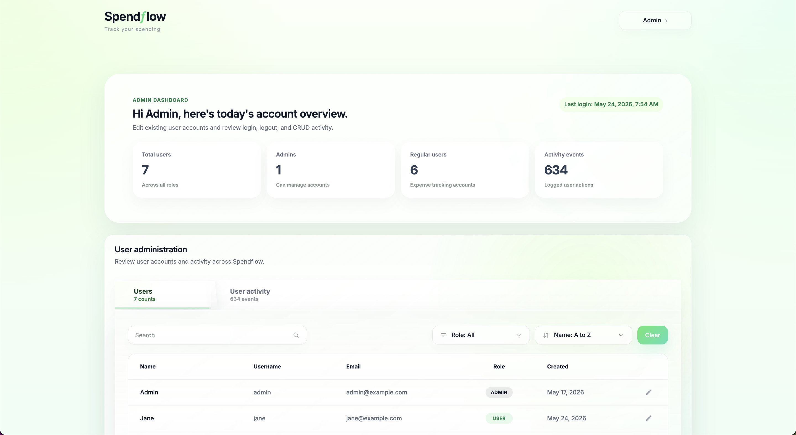

Admin user administration dashboard with summary cards for users and activity.

### Admin Users Tab

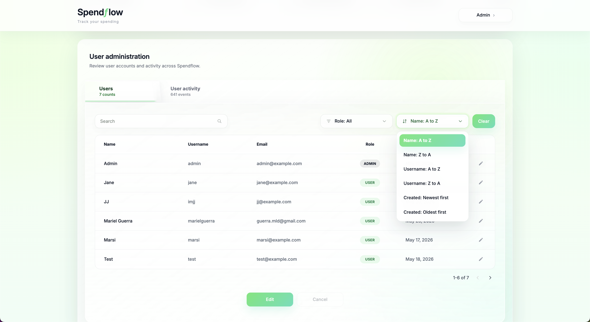

Admin Users tab with account search, role filtering, sorting, pagination, row actions, and table-level edit mode for updating multiple accounts before saving.

### User Details Modal

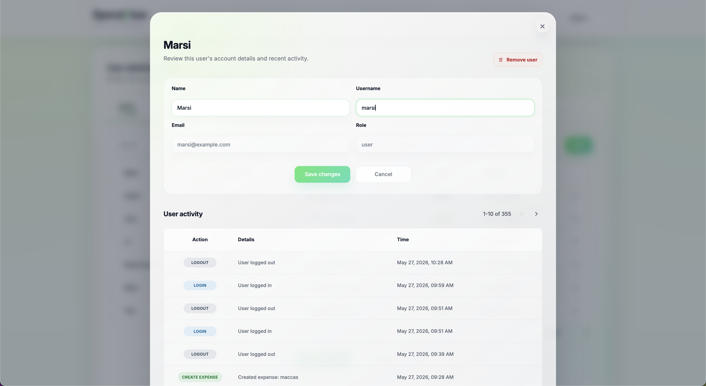

User Details modal for reviewing a selected user's account information and activity history.

### Admin Activity Tab

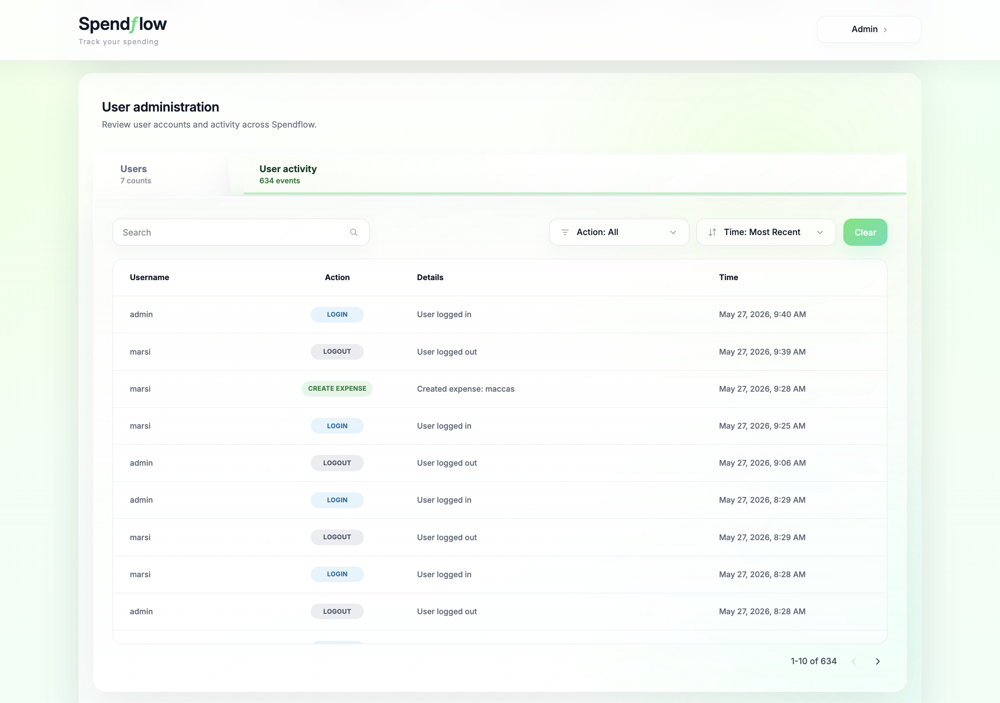

Admin Activity tab showing logged user actions and account events.

### Confirmation Dialogs


Confirmation dialog used for unsaved changes and destructive actions.

## Database Entities

Spendflow uses three main conceptual entities:

| Entity | Purpose |
| --- | --- |
| `users` | Stores account details, hashed passwords, roles, and account timestamps for regular users and admins. |
| `expenses` | Stores each user's expense records, including title, amount, category, date, description, and timestamps. |
| `user_activity` | Stores audit events such as login, logout, registration, account updates, password updates, and CRUD actions. |

## CRUD Operations

| Entity | Create | Read | Update | Delete |
| --- | --- | --- | --- | --- |
| Expenses | Users add expenses through the Add Expense tab. | Users view expenses in Expense History and chart summaries. | Users edit expense rows or table values. | Users delete expense rows. |
| Users | Users register accounts; the admin API also supports creating accounts. | Admins view user lists and user details; users view their own account. | Users update their own account; admins update permitted user details. | Admins delete non-admin user accounts where permitted. |
| User activity | Activity entries are created automatically when key actions occur. | Admins read activity logs in the Admin Activity tab and user details view. | Activity entries are not editable from the UI. | Activity entries are not deleted from the UI. |

## Folder Structure

```text
expense-tracker/
├── index.html                  # Original static HTML version kept as a reference build
├── style.css                   # Original static CSS reference for the Spendflow visual system
├── script.js                   # Original static JavaScript reference implementation
├── Assets/
│   ├── favicon.png             # Main favicon
│   └── screenshots/            # README screenshots
├── database/
│   ├── expense_tracker.sql     # MySQL database setup and seed/sample data
├── server/
│   ├── package.json            # Backend scripts and dependencies
│   ├── server.js               # Express API entry point and local static reference serving
│   ├── db.js                   # MySQL connection pool
│   ├── routes/
│   │   ├── authRoutes.js       # Register, login, logout, and current-user APIs
│   │   ├── userRoutes.js       # Authenticated self-account APIs
│   │   ├── expenseRoutes.js    # Protected expense CRUD APIs
│   │   └── adminRoutes.js      # Admin-only user and activity APIs
│   ├── middleware/
│   │   └── authMiddleware.js   # JWT authentication and role-based access checks
│   ├── utils/
│   │   └── logActivity.js      # Helper for writing activity log entries
│   └── .env.example            # Example environment variable template
└── client/
    ├── package.json            # React/Vite scripts and dependencies
    ├── index.html              # React/Vite HTML entry point
    ├── vite.config.js          # Vite configuration
    ├── public/
    │   ├── favicon.png         # React/Vite favicon
    │   ├── favicon.svg         # Vector favicon
    │   └── icons.svg           # Shared icon sprite
    └── src/
        ├── main.jsx            # React mount file
        ├── App.jsx             # Main application state, routing, and data coordination
        ├── spendflow.css       # Imported original visual baseline
        ├── react.css           # React conversion compatibility and UI polish layer
        ├── services/
        │   └── api.js          # Frontend API client and response normalization helpers
        └── components/
            ├── AuthPage.jsx              # Login and registration UI
            ├── Header.jsx                # Shared logo, account menu, and navigation shell
            ├── UserDashboard.jsx         # Regular user dashboard layout and tabs
            ├── AddExpensePanel.jsx       # Add Expense form
            ├── ExpenseHistoryPanel.jsx   # Expense History table, filters, pagination, and edit flow
            ├── MonthlyTrendPanel.jsx     # Monthly trend chart view
            ├── ManageAccountPanel.jsx    # Account details and password update view
            ├── AdminDashboard.jsx        # Admin dashboard shell, summaries, tabs, and edit guards
            ├── AdminUsersPanel.jsx       # Admin Users table, filters, row actions, and edit mode
            ├── AdminActivityPanel.jsx    # Admin Activity table, filters, sorting, and pagination
            ├── UserDetailsModal.jsx      # Admin user details and selected-user activity modal
            └── Toast.jsx                 # Toast notification component
```

## How to Run the Project

### 1. Install backend dependencies

```bash
cd server
npm install
```

### 2. Import the database

From the project root, import the main database setup file into MySQL:

```bash
mysql -u root -p < database/expense_tracker.sql
```

You can also import `database/expense_tracker.sql` manually through MySQL Workbench or another database tool.

The import script creates the `expense_tracker` database, the required tables, a local app database user, demo users, sample expenses, and an initial activity record.

### 3. Configure environment variables

Copy the example environment file:

```bash
cp server/.env.example server/.env
```

Check the values inside `server/.env`, especially:

```env
DB_HOST=localhost
DB_USER=spendflow_app
DB_PASSWORD=spendflow123
DB_NAME=expense_tracker
JWT_SECRET=replace_with_your_own_secret
```

Do not commit a real `.env` file.

### 4. Start the backend API

```bash
cd server
npm start
```

The backend API runs at:

```text
http://localhost:3000
```

Keep this server running for API requests. Do not use `http://localhost:3000` to review the latest frontend; the root route still serves the original static HTML/CSS/JavaScript reference version.

### 5. Start the React/Vite frontend

Run the React/Vite frontend during development:

```bash
cd client
npm install
npm run dev
```

Open the Vite URL printed in the terminal to review the current React version of Spendflow, usually:

```text
http://localhost:5173
```

The Express backend at `http://localhost:3000` should remain running in the background so the React frontend can communicate with the authentication, user, expense, and admin APIs.

### 6. Build the React frontend

To verify the current React client builds successfully:

```bash
cd client
npm run build
```

## Demo Accounts

The seed data creates two demo accounts for local testing:

| Role | Username | Email | Password |
| --- | --- | --- | --- |
| Admin | `admin` | `admin@example.com` | `password123` |
| User | `marsi` | `marsi@example.com` | `password123` |

## API Overview

### Authentication and account routes

- `POST /auth/register` - create a user account with a bcrypt-hashed password.
- `POST /auth/login` - verify login details and return a JWT plus user profile details.
- `GET /auth/me` - retrieve the currently authenticated user's profile.
- `POST /auth/logout` - record a logout event for the authenticated user.
- `GET /users/me` - retrieve the authenticated user's account details.
- `PUT /users/me` - update the authenticated user's name, username, or email.
- `PUT /users/me/password` - update the authenticated user's password.

### Expense routes

- `GET /expenses` - retrieve the authenticated user's expenses.
- `POST /expenses` - create a new expense.
- `PUT /expenses/:id` - update one of the authenticated user's expenses.
- `DELETE /expenses/:id` - delete one of the authenticated user's expenses.

### Admin routes

- `GET /admin/users` - retrieve all users.
- `POST /admin/users` - create a user account through the admin API.
- `GET /admin/users/:id` - retrieve one user's details.
- `PUT /admin/users/:id` - update permitted details for one user.
- `DELETE /admin/users/:id` - delete a non-admin user account.
- `GET /admin/activity` - retrieve all user activity events.
- `GET /admin/users/:id/activity` - retrieve activity events for one selected user.

## Security and Error Handling

- Passwords are hashed with bcrypt before storage.
- JWTs are issued by the backend after successful login.
- Protected routes require a valid token.
- Admin routes require an admin role.
- Admin-only functions are restricted on the backend, not only hidden in the interface.
- Password updates require the current password before a new password can be saved.
- Password fields in Manage Account are masked by default and can be revealed only through the visibility toggle.
- The app validates required form fields before submission.
- Amount and date inputs include validation to prevent invalid data.
- API failures are handled with visible error messages or toast notifications.
- Destructive or navigation-interrupting actions use confirmation dialogs where appropriate.

## Technical and Interface Design Rationale

- The app uses a single-page structure to dynamically rewrite the current page with new data rather than reloading a new page from the server.
- React components organise the authentication screen, regular user dashboard, admin dashboard, modals, tables, forms, and chart sections.
- Frontend state tracks authentication, current user, expenses, filters, sorting, pagination, edit mode, admin tabs, and modal state.
- API functions communicate with the Express backend after login, registration, expense, account, and admin actions.
- Chart.js is used for the category doughnut chart and monthly trend chart.
- Custom controls keep dropdowns, date selection, table editing, and toast feedback visually consistent.
- Role-based rendering separates regular user and admin flows while sharing the same authentication entry point.

## Workload Allocation

| Group member | Files / folders written or mainly edited | Specific contribution |
| --- | --- | --- |
| Marie Lourdes Danielle Guerra (Marsi) | `client/src/App.jsx`, `client/src/components/`, `client/src/react.css`, `client/src/spendflow.css`, `index.html`, `style.css`, `script.js`, `Assets/screenshots/`, `README.md` | Designed the Spendflow interface and converted the original static UI into the current React/Vite experience, including authentication screens, user dashboard tabs, Add Expense, Expense History editing, charts, Manage Account, admin summary cards, Admin Users and User Activity tabs, user details modal, custom controls, confirmation dialogs, toast feedback, screenshots, and project documentation. |
| Chun-Jie Hsieh (JJ) | `server/`, `server/routes/`, `server/middleware/`, `server/utils/`, `database/expense_tracker.sql`, `client/package.json`, `client/vite.config.js`, `client/src/main.jsx` | Implemented the backend and database foundation for the app, including the Express server, MySQL schema, authentication APIs, protected expense CRUD routes, user profile routes, admin user/activity routes, JWT role-based access control, activity logging, seed data, and React/Vite project setup. |

## Professional Practice Notes

- The repository uses Git version control with meaningful commits.
- Commit messages describe the actual changes made.
- Real environment variables are kept in `.env` and should not be committed.
- The submitted database export contains the schema and seed data needed to run the app locally.
- README screenshots document the submitted interface and the React version follows the same Spendflow visual system.

## Future Improvements

- Move token storage from `localStorage` to a production-safe authentication approach, such as secure HTTP-only cookies.
- Add automated frontend and API tests for auth, admin flows, validation, and editable table behavior.
- Add richer admin audit details for each CRUD event.
- Add deployment configuration for a hosted frontend, backend, and database.

## Submission Files

The submitted project includes:

- `client/` - Current React/Vite frontend application.
- `server/` - Express backend API, authentication, user, expense, and admin routes.
- `database/expense_tracker.sql` - MySQL schema, seed data, and local database setup.
- `Assets/screenshots/` - Interface screenshots used in this README.
- `README.md` - Project overview, setup steps, feature summary, API notes, folder structure, and contribution notes.
- `index.html`, `style.css`, and `script.js` - Original static HTML/CSS/JavaScript version kept as a reference for the React conversion.

For the latest version of Spendflow, run the backend from `server/`, run the React/Vite frontend from `client/`, and open the Vite app at `http://localhost:5173`.
